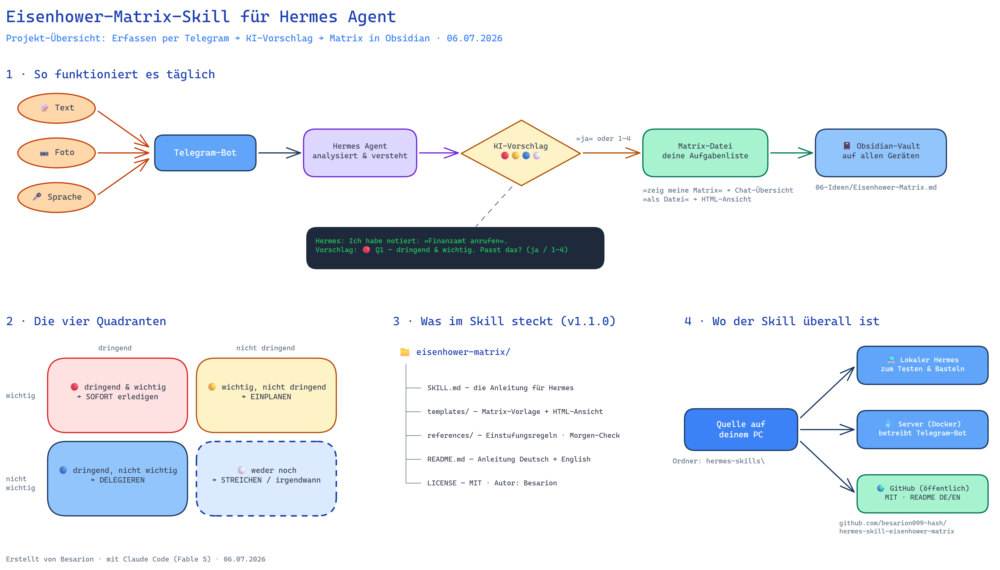

# eisenhower-matrix — Hermes-Agent-Skill

*Deutsch | [English below ⬇](#english)*



Persönlicher Priorisierungs-Assistent nach der Eisenhower-Methode für den [Hermes Agent](https://hermes-agent.nousresearch.com/): Aufgaben per **Text, Bild oder Sprachnachricht** erfassen (z. B. über Telegram), den **KI-Vorschlag** für den passenden Quadranten bestätigen, dauerhafte Matrix im Chat oder als HTML ansehen.

## Funktionen

- 📥 **Erfassen:** Notiz schicken — als Text („Notiz: Zahnarzttermin ausmachen"), Foto (Rechnung, Brief, handschriftliche Liste) oder Sprachnachricht
- 🤖 **KI-Vorschlag:** Hermes analysiert die Eingabe und schlägt einen Quadranten mit Begründung vor — bestätigen mit „ja" oder korrigieren mit 1–4
- 🗂️ **Dauerhafte Matrix:** Alle Aufgaben landen in einer Markdown-Datei (funktioniert auch wunderbar in einem Obsidian-Vault)
- 👀 **Ansehen:** „zeig meine Matrix" → kompakte 🔴🟡🔵⚪-Übersicht im Chat; „als Datei" → HTML-Ansicht (2×2-Grid)
- ✅ **Pflegen in normaler Sprache:** „X erledigt", „verschieb X", „streich X", „räum die Matrix auf"
- ⏰ **Optional:** Anleitung für einen täglichen Morgen-Check per Hermes-Cron (wird nie automatisch eingerichtet)

## Installation

1. Diesen Ordner (`eisenhower-matrix/`) in das Skills-Verzeichnis deines Hermes kopieren:
   - **Linux/macOS:** `~/.hermes/skills/productivity/eisenhower-matrix/`
   - **Windows:** `%USERPROFILE%\.hermes\skills\productivity\eisenhower-matrix\`
   - **Docker:** in den Daten-Ordner, der als Hermes-Home gemountet ist, z. B. `<datenordner>/skills/productivity/eisenhower-matrix/`
2. Prüfen: `hermes skills list` → `eisenhower-matrix` muss erscheinen.
3. Loslegen: eine Notiz schicken — die Matrix-Datei wird beim ersten Einsatz automatisch angelegt.

## Konfiguration (optional)

Speicherort der Matrix-Datei über den Config-Key `eisenhower.file` ändern (absolut oder relativ zum Hermes-Home; Standard `workspace/eisenhower.md`):

```
hermes config set eisenhower.file "obsidian-vault/Eisenhower-Matrix.md"
```

💡 Zeigt der Pfad in einen Obsidian-Vault, erscheint die Matrix automatisch als Notiz in Obsidian.

## Ordnerstruktur

```
eisenhower-matrix/
├── SKILL.md                      # Verhaltensanleitung für Hermes
├── templates/
│   ├── eisenhower.md             # Vorlage der Matrix-Datei
│   └── eisenhower.html           # HTML-Ansicht (2×2-Grid)
├── references/
│   ├── classification-guide.md   # Einstufungsregeln + Beispiele
│   └── cron-setup.md             # Optionaler Morgen-Check
└── README.md
```

Alles ist reines Markdown/HTML — direkt editierbar, keine Skripte, keine Abhängigkeiten.

---

<a name="english"></a>

# eisenhower-matrix — Hermes Agent Skill (English)


A personal prioritization assistant for the [Hermes Agent](https://hermes-agent.nousresearch.com/) based on the Eisenhower method: capture tasks via **text, image, or voice message** (e.g. through Telegram), confirm the **AI-suggested** quadrant, and keep a persistent matrix you can view in chat or as HTML.

## Features

- 📥 **Capture:** send a note — as text ("note: book a dentist appointment"), a photo (invoice, letter, handwritten list), or a voice message
- 🤖 **AI suggestion:** Hermes analyzes the input and proposes a quadrant with a one-sentence reason — confirm with "yes" or correct with 1–4
- 🗂️ **Persistent matrix:** all tasks live in one Markdown file (works beautifully inside an Obsidian vault)
- 👀 **View:** "show my matrix" → compact 🔴🟡🔵⚪ overview in chat; "as a file" → HTML view (2×2 grid)
- ✅ **Maintain in plain language:** "X is done", "move X", "delete X", "clean up the matrix"
- ⏰ **Optional:** guide for a daily morning check via Hermes cron (never set up automatically)

## Installation

1. Copy this folder (`eisenhower-matrix/`) into your Hermes skills directory:
   - **Linux/macOS:** `~/.hermes/skills/productivity/eisenhower-matrix/`
   - **Windows:** `%USERPROFILE%\.hermes\skills\productivity\eisenhower-matrix\`
   - **Docker:** into the data folder mounted as the Hermes home, e.g. `<data-dir>/skills/productivity/eisenhower-matrix/`
2. Verify: `hermes skills list` → `eisenhower-matrix` should appear.
3. Start: just send a note — the matrix file is created automatically on first use.

## Configuration (optional)

Change where the matrix file is stored via the `eisenhower.file` config key (absolute, or relative to the Hermes home; default `workspace/eisenhower.md`):

```
hermes config set eisenhower.file "obsidian-vault/Eisenhower-Matrix.md"
```

💡 Point the path into an Obsidian vault and the matrix automatically shows up as a note in Obsidian.

## Folder structure

Same as above — pure Markdown/HTML, directly editable, no scripts, no dependencies.

---

**Autor / Author:** Besarion · Erstellt mit / Created with Claude (Fable 5) · Lizenz / License: MIT
